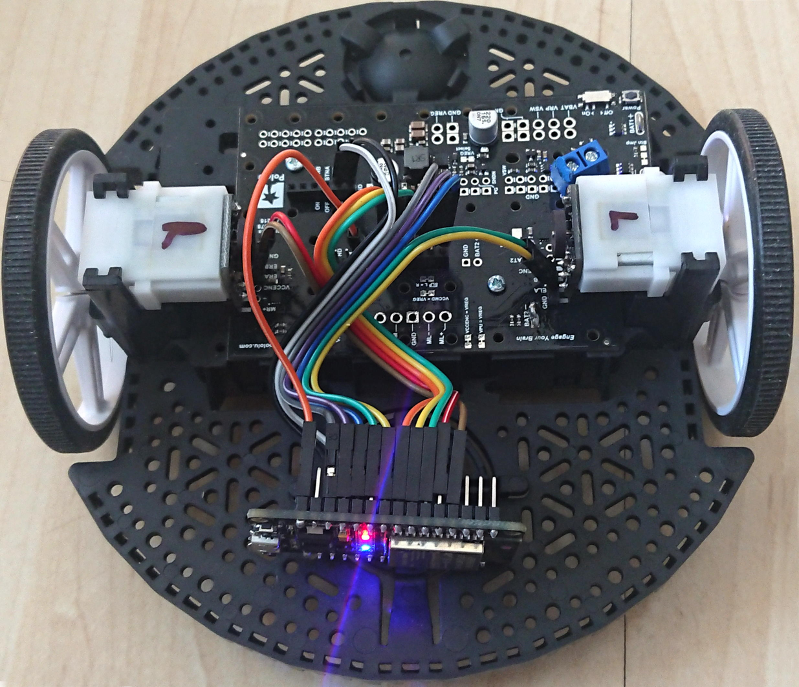
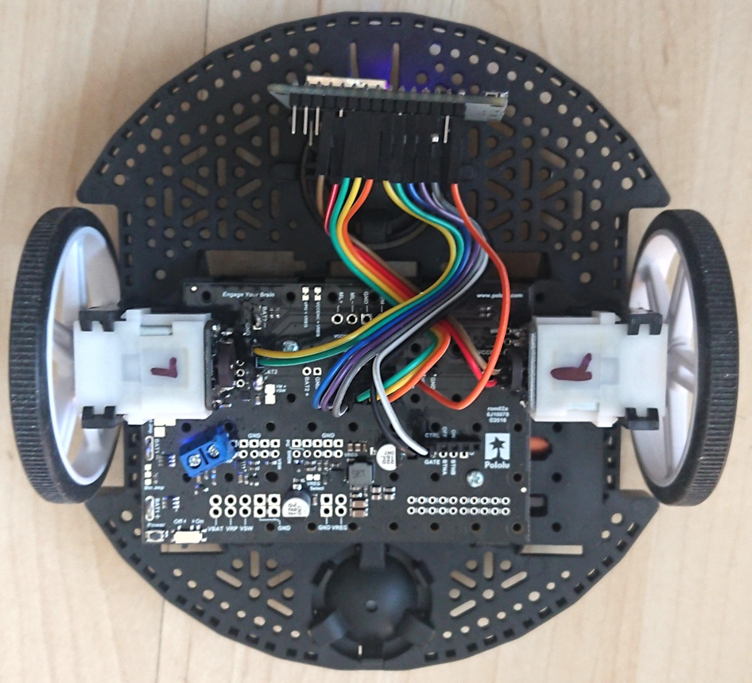
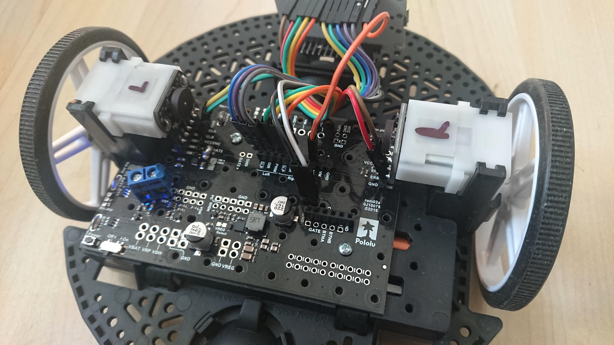

Driver for a Pololu Romi chassis
================================
This is [MicroPython](http://micropython.org) code for driving a [Pololu Romi Chassis](https://www.pololu.com/category/202/romi-chassis-and-accessories) equipped with the [Motor driver and power distribution board](https://www.pololu.com/product/3543).

The exact list of components I used is:
* a [Romi chassis](https://www.pololu.com/product/3500),
* a [pair of Hall effect encoders](https://www.pololu.com/product/3542) for the motors,
* a matching [power and motor control board](https://www.pololu.com/product/3543),
* two [extension plates](https://www.pololu.com/product/3560) to put extra devices on the chassis.
* a [pyboard](https://store.micropython.org/product/PYBv1.1H) or an [ESP32](https://www.espressif.com/en/products/socs/esp32/overview)

There is a version for the Pyboard in module romipyb.py, and a version for the ESP32 in module romiesp32.py.

I experimented with several options to control the chassis remotely through WiFi:
* Using an ESP32 with [MicroWebSrv](https://github.com/jczic/MicroWebSrv) did not give good results, it seems that there are bad interactions between the HTTP/websocket servers and the interrupt handlers for controlling the chassis. A solution that works is to use the ESP32 for the web part only, and to use a Pyboard for controlling the chassis. The ESP32 and the Pyboard communicate through a serial link. This is in the [ClientServeurPyboardESP32](./ClientServeurPyboardESP32/) directory.

* Using an ESP32 with spiRAM with [MicroWebSrv2](https://github.com/jczic/MicroWebSrv2) works fine, but you really need some spiRAM (I used a WROVER-B ESP32) to run MicroWebSrv2. This is in the [ESP32_WebSrv2](./ESP32_WebSrv2/) directory.

* Using a regular ESP32 (WROOM-32) and relying on the webrepl which is built into MicroPython to control the chassis. This works fine, but the inconvenient is that if you kill the main program (which reads from sys.stdin and writes to sys.stdout), you get into the REPL and get complete control on the ESP32. This is in the [ESP32_webrepl](./ESP32_webrepl/) directory.

* The best solution, that works with a regular ESP32 (no spiRAM required), relies on a very basic HTTP server and on a websocket server that I wrote using the websocket and webrepl stuff that is already built into MicroPython. The corresponding modules are available on [github](https://github.com/Frederic-soft/ESP32/tree/master/microserver). This solution has the low cost advantage of the webrepl solution without exposing the REPL of the board on the web. This is in the [ESP32_webrepl](./ESP32_microserver/) directory.

Front view: 

Top view: 

Closeup: 

